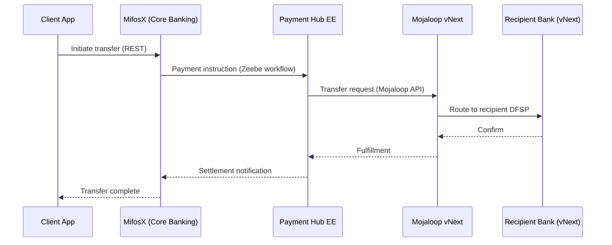
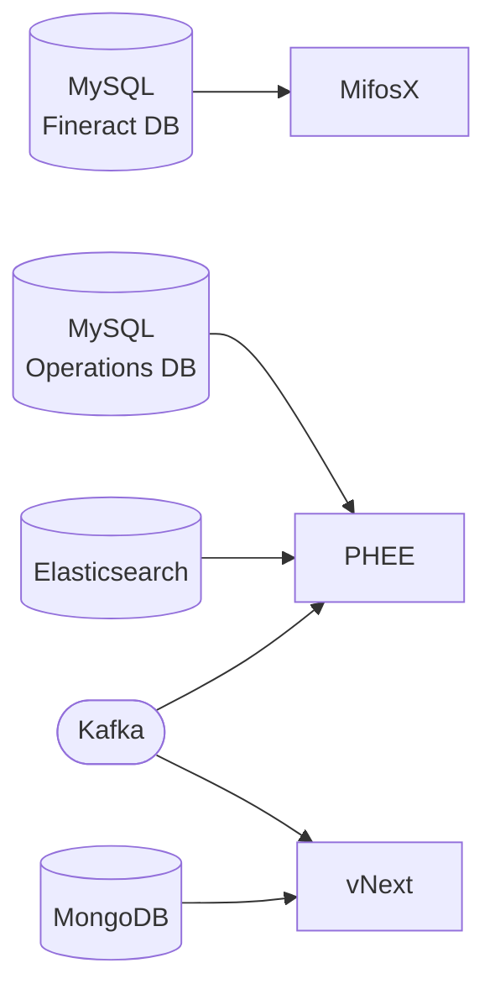

Generate a storyboard for the current Mifos Gazelle deployment: what is deployed, how the systems interact, what data flows through them, and what business value they deliver.

The optional argument `$ARGUMENTS` can be:
- empty — full deployment storyboard
- a component name (`mifosx`, `phee`, `vnext`, `mastercard`) — focused storyboard for that component
- `mermaid` — output only the Mermaid diagrams, no narrative prose
- `demo` — condense into a 3-minute demo script suitable for a client walkthrough

## Step 1: Read the deployment configuration

Read `config/config.ini` to determine which components are enabled and what domain is configured. Note the `[general]` domain, and which of `[mifosx]`, `[phee]`, `[vnext]`, `[mastercard-demo]` have `enabled = true`.

## Step 2: Query live deployment state (if kubectl is available)

Run the following and capture results. If kubectl is not available or the cluster is not reachable, skip this step and note that the storyboard is based on config only.

```bash
kubectl get pods -A --no-headers 2>/dev/null | awk '{print $1, $2, $4}' | sort
kubectl get ingress -A --no-headers 2>/dev/null
```

Categorize pod health:
- Running and Ready → green
- Running but not Ready / CrashLoopBackOff / Pending → amber or red
- Namespace absent → not deployed

## Step 3: Understand the data story

Read these files to understand the integrated data narrative:
- `config/mifos-tenant-config.csv` — tenant banks (greenbank, redbank, bluebank)
- `src/utils/data-loading/` — what seed data scripts exist and what they do (read filenames and first 20 lines of each)
- `src/utils/test-scripts/make-payment.sh` — the payment end-to-end flow
- `src/deployer/deployer.sh` `print_deployment_end_message()` — the access URLs

## Step 4: Generate the storyboard

Produce a markdown document with the following sections. Adjust depth based on `$ARGUMENTS`.

---

### The Story in One Paragraph

2–3 sentences explaining what this deployment is and what problem it solves. Audience: a financial inclusion decision-maker who has never heard of Mifos, Mojaloop, or Payment Hub.

---

### Deployed Components

A table: Component | Status | Access URL | Purpose (one line)

Populate status from Step 2 if available, otherwise from config `enabled` flag.

---

### How the Systems Interact

A Mermaid sequence diagram showing a payment flowing through the stack. Use this as the base — adapt based on what's actually enabled:



If Mastercard is enabled, add a second diagram for the CBS connector flow.

---

### The Tenants

Explain the multi-tenant data setup from `mifos-tenant-config.csv`. Each tenant bank (greenbank, redbank, bluebank) represents a participating financial institution. Describe what accounts and transactions exist in the seed data if the data-loading scripts reveal this.

---

### Data Flows

A Mermaid flowchart showing data at rest:



Adapt based on enabled components.

---

### Walking Through a Payment (Step by Step)

A numbered walkthrough of a real payment using the test script `src/utils/test-scripts/make-payment.sh`. Read that script and extract the actual API calls, amounts, and tenant IDs used. Show what an operator would see at each step:

1. What they call / click
2. What system processes it
3. What state changes
4. What they see as confirmation

---

### Access the Deployment

List the actual URLs based on the `GAZELLE_DOMAIN` from config (or the live ingress from Step 2). Include any login credentials from the test scripts or known defaults.

---

### What to Show in a Demo (if `$ARGUMENTS` is `demo`)

A 3-minute script:
- 0:00–0:30 — Open MifosX, show the three tenant banks and their accounts
- 0:30–1:30 — Run make-payment.sh, narrate what's happening in PHEE/Zeebe
- 1:30–2:30 — Open Zeebe Operate, show the workflow instance completing
- 2:30–3:00 — Show the settled transaction back in MifosX

---

## Output

Write the storyboard to `storyboard.md` in the current directory. Also print a short summary to the terminal: what's deployed, any red components, and the primary access URL.

If `$ARGUMENTS` is `mermaid`, write only the Mermaid diagrams to `storyboard-diagrams.md` instead.
