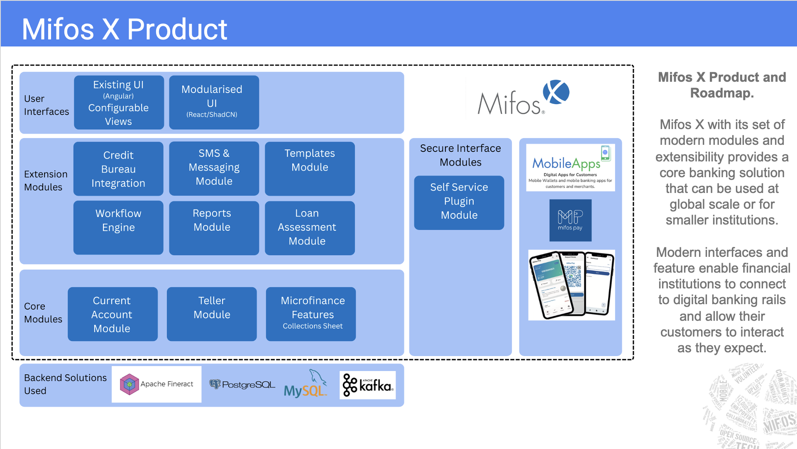

# MifosX

## What It Is

[MifosX](https://mifos.org/) is the core banking Digital Public Good deployed by Mifos Gazelle alongside Payment Hub EE, Mojaloop vNext, OpenSPP and OpenG2P. It provides client and account management, savings, loans, accounting and reporting, and is the system of record that Payment Hub EE debits and credits when a payment settles.

Gazelle deploys MifosX as its own app (`-a mifosx`) into the `mifosx` namespace, tracking the MifosX **25.12.25** release line — Apache Fineract 1.14.0, the Angular web app, and PostgreSQL 16.6. Beyond the core platform, Gazelle integrates five of MifosX's extension modules: Pentaho reporting, the Flowable workflow engine, credit bureau integration, SMS and messaging, and loan assessment.

This document describes each component Gazelle deploys, how to use it, and where the deeper upstream documentation lives.

---

## Table of Contents

- [What It Is](#what-it-is)
- [Deployment Method](#deployment-method)
- [How It Fits into Mifos Gazelle](#how-it-fits-into-mifos-gazelle)
- [Components](#components)
  - [Apache Fineract — core banking engine](#apache-fineract--core-banking-engine)
  - [Web App — Angular user interface](#web-app--angular-user-interface)
  - [PostgreSQL — shared database](#postgresql--shared-database)
  - [Reports Module (Pentaho)](#reports-module-pentaho)
  - [Workflow Engine (Flowable)](#workflow-engine-flowable)
  - [Credit Bureau Integration](#credit-bureau-integration)
  - [SMS & Messaging Module](#sms--messaging-module)
  - [Loan Assessment Module](#loan-assessment-module)
- [Prerequisites](#prerequisites)
- [Getting Started](#getting-started)
- [Building the Module Images](#building-the-module-images)
- [Adding a New MifosX Module](#adding-a-new-mifosx-module)
- [Version Pins](#version-pins)
- [Known Limitations](#known-limitations)
- [Troubleshooting](#troubleshooting)
- [Further Reading](#further-reading)

---

## Deployment Method

MifosX is deployed from **vendored Kubernetes manifests**, which live under `src/deployer/manifests/mifosx/`.

At deploy time, `deploy_mifosx_from_yaml()` in `src/deployer/mifosx.sh` recreates the namespace, copies the manifest directory into a scratch working directory (`/tmp/gazelle-deploy/mifosx`), substitutes the real domain into the web app's deployment and each ingress (`apply_domain_to_file`), restores the Fineract demo-data dump, and applies the whole directory with `apply_kube_manifests`. It then blocks in `wait_for_fineract_api_ready()` until every tenant listed in `FINERACT_TENANTS` answers on the Fineract API before reporting success.

Because the entire directory is applied, **adding a module is mostly a matter of adding its manifests**. That is how all five extension modules were integrated, and it is why per-module setup logic (downloading a plugin, creating a database, waiting on a dependency) is expressed as initContainers in the manifests rather than as shell steps in the deployer. The one thing a new manifest cannot pick up on its own is domain substitution: that is applied per file, so a module adding an ingress also needs a line in `mifosx.sh`. See [Adding a New MifosX Module](#adding-a-new-mifosx-module).

Image tags are pinned in the manifests; see [Version Pins](#version-pins).

---

## How It Fits into Mifos Gazelle

The MifosX product architecture, showing the modules that make up the platform:



The same architecture annotated to show which components Mifos Gazelle actually integrates:

```
  MifosX Product — annotated for Mifos Gazelle

  User Interfaces
  ┌──────────────────────┐  ┌──────────────────────┐
  │ Existing UI          │  │ Modularised UI       │
  │ (Angular)      [LIVE]│  │ (React/ShadCN) [ -- ]│
  └──────────────────────┘  └──────────────────────┘

  Extension Modules
  ┌──────────────────────┐  ┌──────────────────────┐  ┌──────────────────────┐
  │ Credit Bureau        │  │ SMS & Messaging      │  │ Templates            │
  │ Integration    [LIVE]│  │ Module         [LIVE]│  │ Module         [ -- ]│
  └──────────────────────┘  └──────────────────────┘  └──────────────────────┘
  ┌──────────────────────┐  ┌──────────────────────┐  ┌──────────────────────┐
  │ Workflow Engine      │  │ Reports Module *     │  │ Loan Assessment      │
  │                [LIVE]│  │                [LIVE]│  │ Module         [LIVE]│
  └──────────────────────┘  └──────────────────────┘  └──────────────────────┘

  Secure Interface Modules  Mobile Apps
  ┌──────────────────────┐  ┌──────────────────────┐
  │ Self Service         │  │ MobileApps     [ -- ]│
  │ Plugin Module  [ -- ]│  │ Mifos Pay      [ -- ]│
  └──────────────────────┘  └──────────────────────┘

  Core Modules
  ┌──────────────────────┐  ┌──────────────────────┐  ┌──────────────────────┐
  │ Current Account      │  │ Teller Module        │  │ Microfinance         │
  │ Module         [CORE]│  │                [CORE]│  │ Features       [CORE]│
  └──────────────────────┘  └──────────────────────┘  └──────────────────────┘

  Backend Solutions Used
  ┌──────────────────────┐  ┌──────────────────────┐  ┌──────────────────────┐
  │ Apache Fineract[LIVE]│  │ PostgreSQL     [LIVE]│  │ Apache Kafka   [LIVE]│
  └──────────────────────┘  └──────────────────────┘  └──────────────────────┘
```

| Tag | Meaning |
|---|---|
| `[LIVE]` | Integrated — deployed by `./run.sh -m deploy -a mifosx` |
| `[CORE]` | Available through the deployed Fineract, not separately configured or demoed by Gazelle |
| `[ -- ]` | Not in Gazelle's current MifosX scope |

\* The reporting plugin is deployed and its reports are registered, but running one fails until a fixed plugin release ships upstream — see [Reports Module](#reports-module-pentaho).

All five of the MifosX extension modules Gazelle set out to integrate are now deployed. MySQL is not used by the MifosX deployment; Kafka is, but only by the Loan Assessment module, which consumes Fineract's external events from it.

Components deployed into the `mifosx` namespace:

| Component | Deployed as | Image | Purpose |
|---|---|---|---|
| Fineract | `fineract-server` pod | `openmf/fineract:1.14.0` | Core banking engine and API |
| Web App | `web-app` pod + ingress | `openmf/web-app:dev-10d24b8` | Angular user interface |
| Reports | *inside* `fineract-server` | plugin staged by initContainer | Pentaho formatted reporting |
| Workflow Engine | `mifos-workflow` pod + ingress | `kanishksingh23/mifos-workflow:07082026` | Flowable BPMN process orchestration |
| Credit Bureau | `credit-bureau` pod + ingress | `kanishksingh23/mifos-credit-bureau:21082026` | Credit bureau integration |
| SMS & Messaging | `message-gateway` pod + ingress | `openmf/message-gateway:dev-51abedb` | SMS and email delivery |
| Loan Assessment | `loan-module` pod + ingress | `kanishksingh23/mifos-x-reactive-loan-module:09082026` | Reactive loan risk assessment |

PostgreSQL is shared with the rest of Gazelle and lives in the `infra` namespace, not in `mifosx`.

---

## Components

### Apache Fineract — core banking engine

The core platform and API. Multi-tenant: each tenant has its own database, and every API call must carry a tenant header.

| | |
|---|---|
| In-cluster URL | `http://fineract-server:8080/fineract-provider/api/v1/` |
| External URL | `https://mifos.<GAZELLE_DOMAIN>/fineract-provider/api/v1/` |
| Database | shared PostgreSQL, one database per tenant |
| TLS | disabled in-cluster (`FINERACT_SERVER_SSL_ENABLED=false`); TLS terminates at the NGINX ingress |
| Tenants | `greenbank`, `bluebank`, `redbank` (from `FINERACT_TENANTS` in `config.ini`), plus `default` |

```bash
curl -k -u mifos:password \
  -H 'Fineract-Platform-TenantId: greenbank' \
  https://mifos.<GAZELLE_DOMAIN>/fineract-provider/api/v1/offices
```

Two initContainers extend the stock Fineract image at startup, each on behalf of another component: `fetch-reporting-plugin` stages the Pentaho plugin (see [Reports Module](#reports-module-pentaho)), and `enable-loan-events` switches on the external events the Loan Assessment module consumes (see [Loan Assessment Module](#loan-assessment-module)). Both live in `fineract-server-deployment.yaml`.

Upstream documentation: <https://docs.mifos.org/core-banking-and-embedded-finance/core-banking> · API reference: <https://fineract.apache.org/docs/current/>

### Web App — Angular user interface

The standard MifosX web interface, served through an NGINX ingress at `https://mifos.<GAZELLE_DOMAIN>`. Log in as `mifos` / `password` and pick a tenant.

The pinned image is a `dev-` tag rather than the `1.12` release image because the published `1.12` release image is **amd64-only**, which breaks Gazelle's ARM64 targets (Apple Silicon via Colima, and Raspberry Pi). `dev-10d24b8` is the nearest multi-architecture build to that release. This pin should move to a release tag once the web-app release pipeline publishes multi-arch images.

The web app's tenant selector is configured with `greenbank`, `bluebank` and `default`. Note that `redbank` **is** a seeded tenant that Gazelle waits on at deploy time, but it is not in the selector — it is reachable through the API only.

### PostgreSQL — shared database

Every MifosX component stores its data in one shared PostgreSQL instance. It is deployed as part of Gazelle's `infra` chart, so it lives in the `infra` namespace rather than in `mifosx`.

| | |
|---|---|
| Image | `bitnamilegacy/postgresql:16.6.0` |
| In-cluster host | `postgres.infra.svc.cluster.local:5432` |
| Fineract databases | `fineract_tenants`, plus one per tenant — `greenbank`, `bluebank`, `redbank`, `fineract_default` |
| Module databases | `mifos_flowable` (Workflow Engine) · `creditbureau` (Credit Bureau) |

MifosX ran on MySQL/MariaDB before Gazelle standardised on PostgreSQL. Sharing a single instance rather than giving each module its own database pod is what keeps the deployment inside Gazelle's 16GB memory budget. Gazelle still runs MySQL, but only for Payment Hub EE — no MifosX component uses it.

### Reports Module (Pentaho)

Pentaho reporting is **not a separate pod** — the plugin is staged into the `fineract-server` pod at startup. Source: [openMF/mifos-reporting-plugin](https://github.com/openMF/mifos-reporting-plugin); releases are published on [SourceForge](https://sourceforge.net/projects/mifos/files/mifos-plugins/MifosReportingPlugin/).

Apache Fineract ships without Pentaho: it was removed from core during the Mifos → Apache migration for licence reasons, and the ASF-friendly BIRT replacement has no release yet. Fineract's built-in "Stretchy" reports cover on-screen and spreadsheet output only, so formatted PDF reporting requires the plugin.

An initContainer in `fineract-server-deployment.yaml` therefore runs on every deploy and: downloads `MifosReportingPlugin-1.14.0.zip` from SourceForge; stages its 71 jars into `/app/plugins` along with 49 PostgreSQL `.prpt` report definitions; and stages DejaVu fonts plus the fontconfig native library closure, which the Pentaho renderer needs in order to produce PDFs. No custom Fineract image is required, and no change to `mifosx.sh` — the automation lives entirely in the manifest.

**Using it.** In the web app, log in and open **Reports**. Of the 128 reports listed for a tenant, 44 are Pentaho reports — Balance Sheet, Income Statement, Trial Balance, Portfolio at Risk, Aging Detail, Active Loans and so on. Or call the API directly:

```bash
# HTML output
curl -k -u mifos:password \
  -H 'Fineract-Platform-TenantId: greenbank' \
  'https://mifos.<GAZELLE_DOMAIN>/fineract-provider/api/v1/runreports/Client%20Listing(Pentaho)?R_selectOffice=1&output-type=HTML&locale=en'

# PDF output
curl -k -u mifos:password \
  -H 'Fineract-Platform-TenantId: greenbank' \
  'https://mifos.<GAZELLE_DOMAIN>/fineract-provider/api/v1/runreports/Trial%20Balance(Pentaho)?output-type=PDF&locale=en' \
  -o trial-balance.pdf
```

`locale` is required — without it the call fails with a 500 and `NullPointerException: ... "locale" is null`. Date parameters must be supplied as `dd MMMM yyyy`, for example `01 January 2026`.

**On a stock deploy these calls currently return 403 `Pentaho failed: Failed to execute query`.** The plugin is staged and registered, but the published artifact cannot resolve the tenant datasource — see [Known Limitations](#known-limitations). The calls above are the correct form for once a fixed plugin release ships.

Upstream documentation: <https://docs.mifos.org/core-banking-and-embedded-finance/core-banking/pentaho-reporting-plugin>

### Workflow Engine (Flowable)

Orchestrates MifosX business processes — client onboarding, offboarding and transfer; loan origination, disbursement and cancellation — as BPMN 2.0 processes, calling Fineract over REST and persisting process state in its own database. Source: [openMF/mifos-workflow](https://github.com/openMF/mifos-workflow).

| | |
|---|---|
| URL | `http://workflow.<GAZELLE_DOMAIN>` |
| Port | `8081` |
| Health | `GET /actuator/health` |
| API base | `/api/v1` |
| Database | `mifos_flowable` on the shared PostgreSQL |
| Fineract tenant | `greenbank` |

BPMN definitions are auto-deployed from the image at startup and Flowable creates its own schema, so nothing needs restoring. Two initContainers gate startup: `wait-postgres` and `wait-fineract`.

**Using it.** Check the service is up:

```bash
curl http://workflow.<GAZELLE_DOMAIN>/actuator/health
```

**Authenticate before calling a workflow endpoint.** The authentication call takes the credentials as a JSON body — not as HTTP Basic auth — and establishes the Fineract session the workflow endpoints then use:

```bash
curl -X POST http://workflow.<GAZELLE_DOMAIN>/api/v1/auth/authenticate \
  -H 'Content-Type: application/json' \
  -d '{"username":"mifos","password":"password"}'
```

It returns `"authenticated":true`. Confirm with `GET /api/v1/auth/status`, then call the workflow endpoints:

```bash
curl http://workflow.<GAZELLE_DOMAIN>/api/v1/workflow/client-onboarding/tasks

curl -X POST http://workflow.<GAZELLE_DOMAIN>/api/v1/workflow/client-onboarding/start \
  -H 'Content-Type: application/json' -d '{ ... }'
```

**Onboard a client end-to-end with one command.** `src/utils/demo-workflow.sh` runs a full client-onboarding process — it authenticates, ensures a loan officer exists, creates a client, approves the verification task (which assigns the officer and activates the client), and confirms the client is **Active** in Fineract:

```bash
./src/utils/demo-workflow.sh                 # onboards a demo client into greenbank
./src/utils/demo-workflow.sh -t bluebank     # or another tenant
```

To complete an onboarding by hand, approve the pending verification task — this assigns staff and activates the client:

```bash
curl -X POST http://workflow.<GAZELLE_DOMAIN>/api/v1/workflow/client-onboarding/tasks/<taskId>/complete \
  -H 'Content-Type: application/json' \
  -d '{"approved":true,"clientId":<id>,"staffId":<id>}'
```

The module runs on PostgreSQL, in line with the move of MifosX to standardise on PostgreSQL.

### Credit Bureau Integration

Registers credit-bureau credentials, pulls client and address data from Fineract, and fetches or submits credit reports. Source: [openMF/mifos-x-credit-bureau-plugin](https://github.com/openMF/mifos-x-credit-bureau-plugin).

| | |
|---|---|
| URL | `http://credit-bureau.<GAZELLE_DOMAIN>` |
| Port | `8081` |
| Health | `GET /credit-bureaus` |
| Database | `creditbureau` on the shared PostgreSQL |

Gazelle runs it with `CDC_MOCK_ENABLED=true` — the default bureau target is Círculo de Crédito (a Mexican bureau) and no real credentials are configured, so instead of calling a live bureau it returns a mock report built from the requested client's real Fineract data (name, RFC) plus a sample score and account. It reads client data from the Fineract tenant named by `FINERACT_TENANT_IDENTIFIER` (default `greenbank`, which carries the demo clients). Two initContainers gate startup: `ensure-creditbureau-db` creates the database if it does not exist, and `wait-for-fineract` blocks until the core API answers.

**Using it.** List the configured bureaus — an empty array on a fresh deploy, since none are registered yet:

```bash
curl http://credit-bureau.<GAZELLE_DOMAIN>/credit-bureaus
```

For an end-to-end demo — register a bureau, fetch a demo client, and pull a mock report — run `./src/utils/demo-credit-bureau.sh`. It prints a readable summary: the client's name, a bureau score, and a sample account. Pass `-i <client_id>` to report on a different client.

Two things worth knowing. Health probes hit `GET /credit-bureaus` rather than `/actuator/health`, because Jersey is mapped at `/*` and shadows the actuator endpoints — `/actuator/*` returns 404. That endpoint needs no auth (only `/api/**` is authenticated) and touches the database, so it is a genuine readiness signal. And `MIFOS_SECURITY_ENCRYPTION_KEY` has no default: the application will not start without it.

### SMS & Messaging Module

Delivers SMS and email on behalf of MifosX through a REST push interface, with pluggable provider bridges. Source: [openMF/message-gateway](https://github.com/openMF/message-gateway).

| | |
|---|---|
| URL | `http://message-gateway.<GAZELLE_DOMAIN>` |
| Ports | `9191` (REST API) · `5009` (delivery-status callbacks) |
| Health | `GET /actuator/health` |
| Database | `messagegateway` on the shared PostgreSQL |

An `ensure-messagegateway-db` initContainer creates the database if it does not exist. The image is an upstream `openmf` build, so unlike the workflow engine and credit bureau this module needs no local build.

**Using it.** Check the service is up:

```bash
curl http://message-gateway.<GAZELLE_DOMAIN>/actuator/health
```

No SMS or email provider credentials are configured in Gazelle, so the gateway accepts and records requests but cannot deliver to a real handset. Configuring a live provider is a deployment-time decision, not something Gazelle presumes.

### Loan Assessment Module

A reactive loan risk assessment service. It consumes Fineract's external events from Kafka, scores loan applications, and writes results to its own database. Built on Spring WebFlux with R2DBC rather than blocking JDBC. Source: [openMF/reactive-loan-module](https://github.com/openMF/reactive-loan-module).

This module is the only one that needs Fineract itself reconfigured. Fineract publishes external events to Kafka (`FINERACT_EXTERNAL_EVENTS_ENABLED`, `FINERACT_EXTERNAL_EVENTS_KAFKA_ENABLED`), and an `enable-loan-events` initContainer on `fineract-server` switches on the six event types this module listens for — `LoanCreatedBusinessEvent`, `LoanApplicationModifiedBusinessEvent`, `LoanRejectedBusinessEvent`, `LoanWithdrawnByApplicantBusinessEvent`, `DocumentCreatedBusinessEvent` and `DocumentDeletedBusinessEvent` — **on the `default` tenant only**. Adding an event type or another tenant means editing that initContainer, not the loan module.

| | |
|---|---|
| URL | `http://loan-module.<GAZELLE_DOMAIN>` |
| Port | `8080` |
| Health | `GET /actuator/health` |
| Database | `loanrisk` on the shared PostgreSQL (R2DBC at runtime, JDBC for Liquibase migrations) |
| Kafka | `kafka.infra.svc.cluster.local:9092` |
| Fineract tenant | `default` |

An `ensure-loanrisk-db` initContainer creates the database, and Liquibase applies the schema at startup.

**Using it.**

```bash
curl http://loan-module.<GAZELLE_DOMAIN>/actuator/health
```

This is the one MifosX module that is event-driven rather than request-driven: it reacts to Fineract loan events published to Kafka, so exercising it means creating loan activity in Fineract rather than calling the module directly. It is also the only MifosX component that uses Kafka — every other module talks to Fineract over REST.

---

## Prerequisites

- Same base setup as any Gazelle deployment (`sudo ./setup-env.sh -u $USER`)
- No sudo required to deploy MifosX itself

---

## Getting Started

### 1. Enable in `config/config.ini`

```ini
[mifosx]
enabled = true
MIFOSX_NAMESPACE = mifosx
FINERACT_USERNAME = mifos
FINERACT_PASSWORD = password
FINERACT_TENANTS = greenbank bluebank redbank
```

`FINERACT_TENANTS` is the list of tenants the deployer waits on before declaring MifosX ready.

### 2. Deploy

```bash
./run.sh -m deploy -a mifosx      # MifosX only
./run.sh -m deploy -a all         # every DPG
```

The deploy recreates the namespace, restores the demo-data dump, applies the manifests, and waits for each tenant's API to answer.

### 3. Log in

Open `https://mifos.<GAZELLE_DOMAIN>` — by default `https://mifos.mifos.gazelle.test` — and log in as `mifos` / `password`. Select tenant `greenbank`, `bluebank` or `default`.

Each extension module has its own ingress — browse or `curl` them at `http://workflow.<GAZELLE_DOMAIN>`, `http://credit-bureau.<GAZELLE_DOMAIN>`, `http://message-gateway.<GAZELLE_DOMAIN>` and `http://loan-module.<GAZELLE_DOMAIN>`, as shown in their sections above.

### /etc/hosts entries

`setup-env.sh` writes these automatically. If you set the machine up before the workflow and credit bureau ingresses were added, re-run `sudo ./setup-env.sh -u $USER` to pick up the two new hostnames.

```
# Linux/macOS
<VM-IP> fineract.mifos.gazelle.test mifos.mifos.gazelle.test workflow.mifos.gazelle.test credit-bureau.mifos.gazelle.test loan-module.mifos.gazelle.test message-gateway.mifos.gazelle.test

# Windows (one per line)
<VM-IP> mifos.mifos.gazelle.test
<VM-IP> fineract.mifos.gazelle.test
<VM-IP> workflow.mifos.gazelle.test
<VM-IP> credit-bureau.mifos.gazelle.test
<VM-IP> loan-module.mifos.gazelle.test
<VM-IP> message-gateway.mifos.gazelle.test
```

---

## Building the Module Images

Most MifosX components run published images. Three do not — the **Workflow Engine**, the **Credit Bureau** and **Loan Assessment** — because none of those projects publishes a container image, so Gazelle's pins are built from source. The PostgreSQL support the workflow engine and credit bureau need is merged upstream ([mifos-workflow#73](https://github.com/openMF/mifos-workflow/pull/73), [mifos-x-credit-bureau-plugin#141](https://github.com/openMF/mifos-x-credit-bureau-plugin/pull/141)), so a clone of the upstream repository builds a working image with no local patching.

`./run.sh -m deploy -a mifosx` checks that every image referenced by the manifests can be found in a registry and warns, naming any it cannot. The check is advisory and never blocks the deploy — a rate-limited or private registry is indistinguishable from a missing image — but it tells you to build before the pods fail to pull.

Build and publish with [`src/utils/build-and-import-image.sh`](BUILDING-IMAGES.md), the same builder the rest of Gazelle uses. Log in to the registry first (`docker login`), then — substituting a `<namespace>` you can push to, and matching the `<tag>` to the pin in the module's manifest:

```bash
# Workflow Engine — multi-architecture, pushed to the registry
git clone https://github.com/openMF/mifos-workflow.git
src/utils/build-and-import-image.sh \
    -n <namespace>/mifos-workflow -t <tag> \
    -c mifos-workflow -f mifos-workflow/Dockerfile \
    --platform linux/amd64,linux/arm64 --push

# Credit Bureau — multi-architecture, pushed to the registry
git clone https://github.com/openMF/mifos-x-credit-bureau-plugin.git
src/utils/build-and-import-image.sh \
    -n <namespace>/mifos-credit-bureau -t <tag> \
    -c mifos-x-credit-bureau-plugin -f mifos-x-credit-bureau-plugin/Dockerfile \
    --platform linux/amd64,linux/arm64 --push

# Loan Assessment — multi-architecture, pushed to the registry
git clone https://github.com/openMF/reactive-loan-module.git
src/utils/build-and-import-image.sh \
    -n <namespace>/mifos-x-reactive-loan-module -t <tag> \
    -c reactive-loan-module -f reactive-loan-module/Dockerfile \
    --platform linux/amd64,linux/arm64 --push
```

The manifests currently pin these images to a personal namespace, because pushing to `openmf` needs Mifos DockerHub access. Once they are published under `openmf`, change `<namespace>` to `openmf` here and update the `image:` pins to match.

`--platform linux/amd64,linux/arm64` is what keeps Apple Silicon and Raspberry Pi working, and it requires `--push` — a multi-platform build produces a manifest list, which only a registry can hold.

To iterate locally instead, drop `--platform` and `--push`: the script then builds for the host architecture and imports straight into k3s, so a redeploy picks the image up without a registry round-trip.

```bash
src/utils/build-and-import-image.sh \
    -n <namespace>/mifos-workflow -t <tag> \
    -c mifos-workflow -f mifos-workflow/Dockerfile
```

After publishing, update the `image:` pin in the module's manifest under `src/deployer/manifests/mifosx/` to match the tag you pushed.

---

## Adding a New MifosX Module

The three modules integrated so far follow one pattern. To add a fourth:

1. **Check the database.** Gazelle's MifosX stack is PostgreSQL-only. If the module is tied to MySQL, make it database-agnostic at source — add the PostgreSQL driver alongside the existing one, make the datasource environment-overridable, keep the upstream default unchanged, and remove any hardcoded dialect. That keeps the change upstreamable instead of creating a fork.
2. **Build a multi-architecture image.** Gazelle targets amd64 and arm64 — an amd64-only image breaks Apple Silicon and Raspberry Pi deployments. Use the repo's own builder rather than raw `docker buildx`; see [Building images for Gazelle](BUILDING-IMAGES.md):
   ```bash
   src/utils/build-and-import-image.sh -n openmf/<module> -t <tag> \
       --platform linux/amd64,linux/arm64 --push
   ```
3. **Share the infrastructure.** Point the module at `postgres.infra.svc.cluster.local:5432` with its own database rather than deploying a database pod, and add an initContainer that creates that database if it does not exist.
4. **Gate on dependencies.** Add initContainers that wait for PostgreSQL and for Fineract's API, so the module does not crash-loop while the core is still starting.
5. **Verify the probe path.** Confirm which port and path actually answer — several MifosX modules document ports or actuator paths that do not match their runtime behaviour.
6. **Expose it through an ingress.** Add an ingress manifest on its own `<module>.<GAZELLE_DOMAIN>` host so users can browse or `curl` a URL rather than running `kubectl port-forward`. Add that hostname to `MIFOSXHOSTS` in `src/environmentSetup/environmentSetup.sh`, and add an `apply_domain_to_file` call for the new ingress in `src/deployer/mifosx.sh` — domain substitution is per file, not directory-wide.
7. **Add manifests and document.** Drop the deployment and service YAML into `src/deployer/manifests/mifosx/`, pin the image tag explicitly, add a section to this file and a row to the component table, and verify with a real `./run.sh -m deploy -a mifosx`.

---

## Version Pins

All image tags are pinned — no `:latest`. The current pins live in the manifests under `src/deployer/manifests/mifosx/`; the components and their tags are listed in the table under [How It Fits into Mifos Gazelle](#how-it-fits-into-mifos-gazelle).

---

## Known Limitations

- **Pentaho per-tenant routing needs a fixed plugin release.** The published plugin resolves its datasource in a way that can return another tenant's data. The fix is a two-line change, merged upstream into `openMF/mifos-reporting-plugin` ([PR #513](https://github.com/openMF/mifos-reporting-plugin/pull/513), `pentaho` branch), but **no fixed release has been published yet** and Gazelle installs the published artifact. Until a fixed release ships, treat multi-tenant report output as unreliable. Closing this needs either a new plugin release or a temporary class swap in the initContainer.
- **The Workflow Engine, Credit Bureau and Loan Assessment images are temporary.** None of those projects publishes a container image, so all three are built from source and currently pushed to a personal DockerHub namespace. All three pins should move to `openMF` images once those are published — see [Building the Module Images](#building-the-module-images) for the build and publish commands.
- **The Loan Assessment module only sees the `default` tenant.** The `enable-loan-events` initContainer enables external events on that tenant alone, so loan activity on `greenbank`, `bluebank` or `redbank` produces no events for it to consume. Widening it means editing that initContainer in `fineract-server-deployment.yaml`, not the module.
- **No SMS or email provider is configured.** The message gateway accepts and records requests, but with no provider credentials it cannot deliver to a real handset or mailbox. Wiring a live provider is a deployment-time decision.
- **`redbank` is not selectable in the web app.** It is seeded and waited on at deploy time, but absent from the web app's tenant list, so it is reachable through the API only.

---

## Troubleshooting

**A module pod is stuck in `Init`** — its initContainers are still waiting on a dependency:
```bash
kubectl -n mifosx get pods
kubectl -n mifosx logs <pod-name> -c wait-fineract
kubectl -n mifosx logs <pod-name> -c wait-postgres
```

**A Pentaho report returns 500 with `NullPointerException: ... "locale" is null`** — the request is missing the required `locale` parameter. Add `&locale=en`.

**A Pentaho report returns 403 "Failed to execute query"** — the plugin's datasource did not resolve for the tenant; see the per-tenant limitation above. This is the expected result on a stock deploy until a fixed plugin release ships. Confirm the plugin itself loaded:
```bash
kubectl -n mifosx logs <fineract-pod> -c fetch-reporting-plugin
kubectl -n mifosx exec <fineract-pod> -- ls /app/plugins | wc -l   # expect 71 jars
```

**A Pentaho report renders but every total is zero** — the tenant has no posted general-ledger entries. The seeded demo data creates a savings product with CASH accounting so deposits and withdrawals post to the GL, but a tenant restored from an older dump, or one whose accounts have no transactions, will still report zeros.

**A report rejects its date parameter** — dates must be formatted `dd MMMM yyyy`, e.g. `01 January 2026`.

**`POST /api/v1/auth/authenticate` returns 500 "Required request body is missing"** — the credentials go in a JSON body, not in HTTP Basic auth:
```bash
curl -X POST http://workflow.<GAZELLE_DOMAIN>/api/v1/auth/authenticate \
  -H 'Content-Type: application/json' \
  -d '{"username":"mifos","password":"password"}'
```

**A workflow endpoint reports it is not authenticated** — run the authenticate call above first, then check `GET /api/v1/auth/status` returns `{"authenticated":true}`.

**`/actuator/health` on the Credit Bureau returns 404** — expected, Jersey shadows `/actuator/*`. Use `GET /credit-bureaus` instead.

**The Loan Assessment module logs nothing when a loan is created** — check the loan was created on the `default` tenant, and that the event type is one of the six enabled. Confirm Fineract emitted it:
```bash
kubectl -n mifosx logs deploy/fineract-server -c enable-loan-events
kubectl -n mifosx logs deploy/loan-module | tail -30
```

**Fineract never becomes ready and the deploy times out** — check which tenant is failing to initialise:
```bash
kubectl -n mifosx logs deploy/fineract-server | tail -50
```
Raise `startup_timeout` in `config/config.ini` on slow or resource-constrained hosts.

---

## Further Reading

- [Mifos Gazelle deployment guide](MIFOS-GAZELLE-README.md)
- [Release notes](RELEASE-NOTES.md)
- MifosX core banking: <https://docs.mifos.org/core-banking-and-embedded-finance/core-banking>
- Apache Fineract API: <https://fineract.apache.org/docs/current/>

Questions about this deployment go to the `#mifos-gazelle` channel on [Mifos Slack](https://mifos.slack.com).
