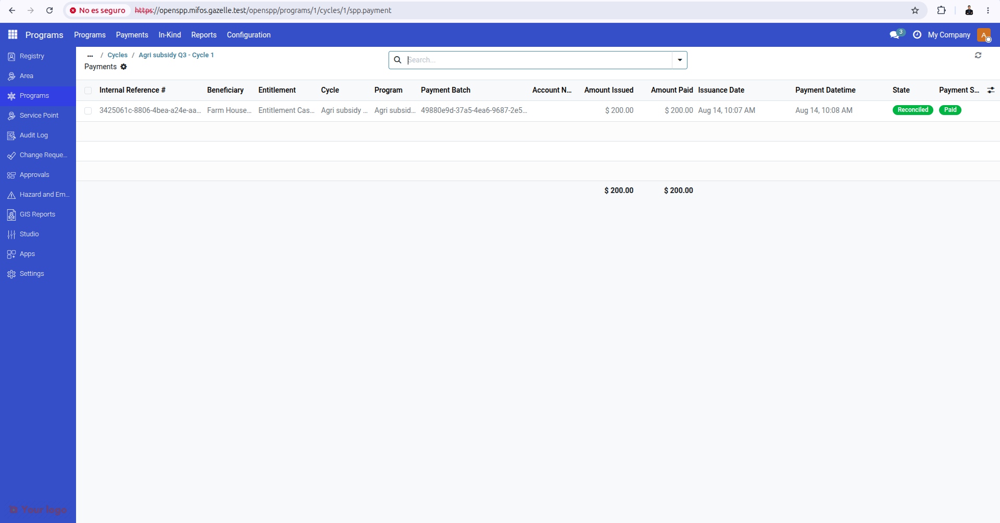
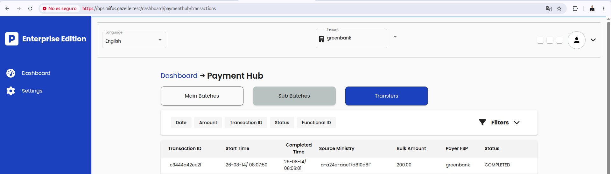
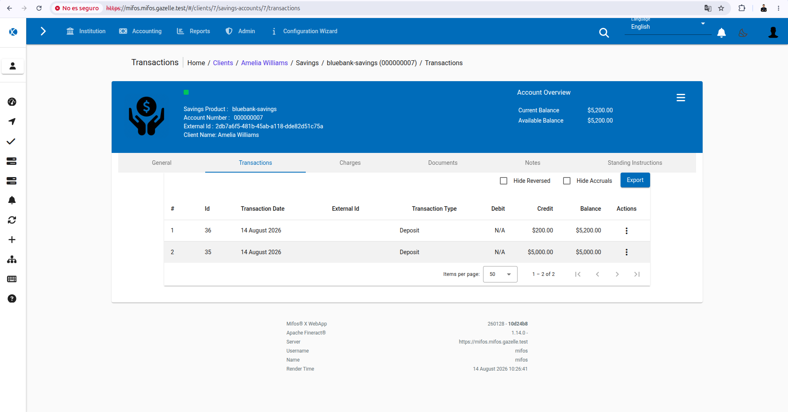
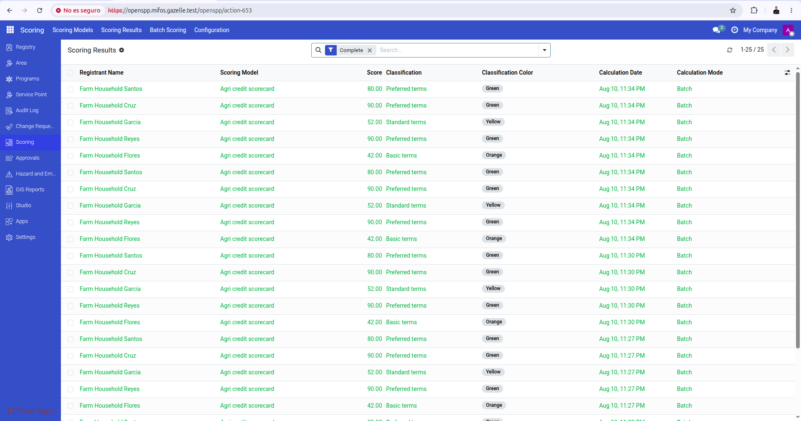
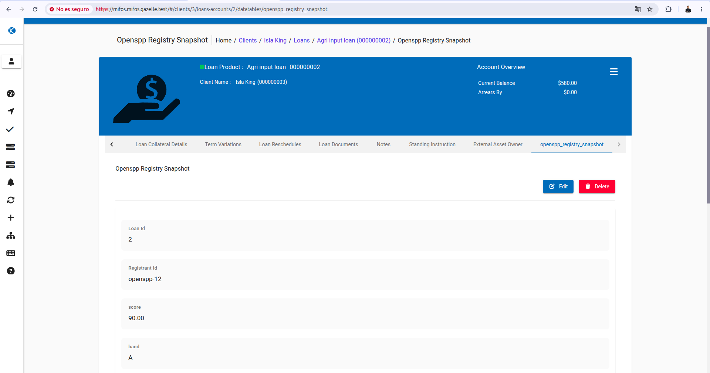

# OpenSPP2 on Mifos Gazelle

- [What this is](#what-this-is)
- [Prerequisites](#prerequisites)
- [Configuration](#configuration)
- [Deploy](#deploy)
- [Access](#access)
- [Using it once deployed](#using-it-once-deployed)
- [The agri demo: OpenSPP to Payment Hub to MifosX](#the-agri-demo-openspp-to-payment-hub-to-mifosx)
- [The agri credit demo: farmer registry to a MifosX loan](#the-agri-credit-demo-farmer-registry-to-a-mifosx-loan)
- [Smoke test](#smoke-test)
- [Teardown](#teardown)
- [Notes / limitations](#notes--limitations)

## What this is

[OpenSPP](https://openspp.org) is an open source social protection platform. It is the **social
registry**: it holds the people and households a government or agency wants to help (individuals,
groups, farms, land), decides who is eligible for a benefit, and works out how much each one should get.
Benefits are organised as **programmes** with **cycles** and **entitlements**. It is built on Odoo, so it
is a web application with its own database.

In Gazelle it fills the gap the other DPGs do not cover. MifosX is the core banking system, Payment Hub
EE orchestrates payments and Mojaloop vNext is the switch, but none of them knows **who** the
beneficiaries are or **why** they should be paid. OpenSPP answers that, so a full chain becomes possible:
a beneficiary registered in OpenSPP -> a subsidy calculated for them -> paid through Payment Hub EE ->
credited in a MifosX account.

**OpenSPP2** (Odoo 19) is the current version and the one Gazelle deploys. It is an **optional** DPG,
disabled by default (`[openspp] enabled = false` in `config/config.ini`), and self-contained: it brings
its own **PostgreSQL 18 + PostGIS 3.6** database, so it does not use the shared infra chart.

```
                      Browser (HTTPS)
                             |
              NGINX ingress  openspp.<GAZELLE_DOMAIN>
                 /  -> :8069            /websocket -> :8072
                             |
                   Service openspp-odoo
                             |
        odoo (Deployment)                jobworker (Deployment)
        Odoo 19 + OpenSPP                async queue worker
        self-initialises the DB          no Service, no HTTP
                             |                    |
                             +---------+----------+
                                       |
                            Service openspp-postgis
                                       |
                              postgis (StatefulSet)
                              postgis/postgis:18-3.6-alpine
```

Both paths of the ingress go to the `openspp-odoo` Service: `/websocket` to the longpolling port (8072)
and everything else to the HTTP port (8069). The jobworker has no Service and serves no HTTP; it only
talks to the database, where it picks up queued jobs.

The Odoo container **self-initialises** on first boot (its entrypoint installs `base` then the module
in `ODOO_INIT_MODULES`), so there is **no separate init Job**.

## Prerequisites

1. A running cluster. On a fresh machine: `sudo ./setup-env.sh -u $USER` (installs k3s + tools).
2. Nothing else on amd64: the images are pulled. `docker` with the buildx plugin is only needed to
   build the application image yourself, which is the fallback when the configured one cannot be
   pulled. See [Building images](BUILDING-IMAGES.md).

The deploy checks three things in order and picks the cheapest that works: the image is already in the
cluster, the image can be pulled from its registry, or it has to be built. Only the third one costs
anything, about **30 minutes and 3 GB of disk** the first time, and the import step asks for `sudo`.
Both the source checkout and the image are reused, so a second deploy does neither.

Before any of that, the deploy checks that both images publish a build for the architecture of the
cluster nodes, and stops with the key to change if they do not. That check costs one registry request,
and only for an image that is not on the node already.

To build the application image by hand instead, or to look at what the deploy runs:

```bash
src/utils/build-and-import-image.sh -n ismaelyz23/openspp -t 19.0 \
    -c <OpenSPP2 checkout> -f <OpenSPP2 checkout>/docker/Dockerfile --target production
```

> The import loads the image into the container runtime of a k3s cluster **on this machine**, so it
> does not work against a remote cluster, nor on macOS where the cluster lives inside the Colima VM.
> There, build the image and `--push` it to a registry, or build it on the cluster node itself. The
> deploy reports this before it starts building.

> Keep the node's `/` disk below ~85%, or k3s image garbage collection may evict the image, which
> cannot be pulled back.

## Configuration

`config/config.ini`, section `[openspp]`:

| Key | Default | Notes |
|-----|---------|-------|
| `enabled` | `false` | Optional DPG; deploy explicitly with `-a openspp`. |
| `OPENSPP_IMAGE_REPOSITORY` / `OPENSPP_IMAGE_TAG` | `ismaelyz23/openspp` / `19.0` | The image the pods run, amd64 and arm64 under the same tag. Upstream publishes none, so it is built from their sources and it also carries OpenSPP's payment connector module. |
| `OPENSPP_POSTGIS_REPOSITORY` / `OPENSPP_POSTGIS_TAG` | `postgis/postgis` / `18-3.6-alpine` | The database image, also used by the two wait-for-db init containers. The official one is amd64 only; arm64 needs a multi-architecture build. |
| `OPENSPP_BUILD_IF_MISSING` | `true` | Build during the deploy when the image is neither in the cluster nor pullable. `false` stops instead, printing the build command. |
| `OPENSPP_SOURCE_REPO` / `OPENSPP_SOURCE_REF` | OpenSPP2 upstream / `v19.0.2.0.0` | Source used for that build. Only read when a build is needed. |
| `OPENSPP_NAMESPACE` / `OPENSPP_RELEASE_NAME` | `openspp` | Namespace and Helm release. |
| `OPENSPP_DB_PASSWORD_FILE` / `OPENSPP_ADMIN_PASSWORD_FILE` | empty | File paths for real secrets (prod/remote). Empty = local-dev defaults. |

When the password files are empty, local-dev defaults are used: login **admin / admin** and a fixed DB
password (which also keeps re-deploys idempotent). For production, point the `*_FILE` keys at files
holding real secrets.

## Deploy

```bash
./run.sh -m deploy -a openspp
```

This makes sure the image is available, deploys PostGIS, Odoo and the job worker, waits for them to be
Ready, and runs `tests/openspp/smoke.sh`.

Running it again is safe, but by default it removes the deployment and creates it new, so the database
does not survive. That removal happens after the checks above, so a deploy that cannot work leaves what
you had alone. Add `-r false` to upgrade the existing release and keep the data:

```bash
./run.sh -m deploy -a openspp -r false
```

## Access

OpenSPP is exposed over HTTPS through the shared NGINX ingress at `openspp.${GAZELLE_DOMAIN}`
(default `openspp.mifos.gazelle.test`):

```
https://openspp.mifos.gazelle.test/web/login      # admin / admin
```

`setup-env.sh` adds the host to `/etc/hosts` when it sets up a local cluster. It does not in `-e remote`
mode, so there you add it by hand, pointing at the VM IP from your client machine. On Linux a local
cluster can point to `127.0.0.1`, which is stable across restarts. The TLS certificate is self-signed,
so accept the warning on first visit.

Without the ingress you can port-forward:

```bash
kubectl port-forward svc/openspp-odoo 8069:8069 -n openspp   # then http://localhost:8069/web/login
```

## Using it once deployed

Log in with **admin / admin**. The chart installs the base module `spp_base_common`, which gives the
OpenSPP shell: a left menu with **Registry** (the social registry: individuals and groups), **Apps**, and
**Settings**. Which other menus appear depends on the modules you install.

A useful first walkthrough:

1. Open **Registry** and add a registrant, to confirm the database is writable and the UI works.
2. Open **Apps** to see the OpenSPP modules. The list is filtered to the official OpenSPP apps; clear
   the filter to see all of them. Press **Activate** on the one you want.
3. Go back to **Registry**: new fields, views and menus appear once the module is installed.

Useful starting points in **Apps**:

| App | What it adds |
|-----|--------------|
| **OpenSPP Registry** | Consolidated registry management for individuals, groups and membership. |
| **OpenSPP Programs** | Programmes, cycles and entitlements (cash and in-kind), the base for any benefit delivery. |
| **OpenSPP Starter: Farmer Registry** | A ready-made agriculture bundle: farm fields (farm size, land tenure, crops, livestock), FAO vocabularies, land records, irrigation, GIS, and Programs. |
| **OpenSPP API V2** | REST API for external data exchange. |

Modules can also be installed at deploy time instead of by hand, with the `modules` value of the chart
(comma-separated, no spaces), so a fresh deploy comes up with everything already installed.

## The agri demo: OpenSPP to Payment Hub to MifosX

Deploying OpenSPP on its own does not show much. Gazelle exists to show the DPGs working together, and
this demo runs the whole line with one command: five farmer households registered in OpenSPP receive a
crop subsidy, the payment crosses Payment Hub and the money lands in each beneficiary's savings account
in MifosX. Then it checks in core banking that it really arrived, and writes the result back into
OpenSPP so the programme shows the subsidies as paid.

It is a demo for a deployed machine, not a test: it needs a real cluster and it moves real balances in
the deployed core banking.

### What you need

The **whole stack**, not just OpenSPP. The demo checks this first and stops if a namespace is missing:

| Namespace | Why |
|-----------|-----|
| `openspp` | The registry: programme, beneficiaries and entitlements |
| `mifosx` | Core banking, where the money ends up |
| `paymenthub` | Orchestrates the payment |
| `vnext` | The switch that routes it, and the account lookup |

```bash
./run.sh -m deploy -a all       # the core apps
./run.sh -m deploy -a openspp   # OpenSPP is optional, so it is deployed on its own
```

### Run it

```bash
bash demos/openspp/run_demo.sh
```

It prints each step as it goes and finishes with the result:

```console
==> Pay approved entitlements via PHEE channel/transfer, one at a time
  OK Farm Household Santos (0495700001) acct 6: credited USD 200 - marked Paid in OpenSPP
  ...
OK: 5/5 agri subsidies disbursed & confirmed in MifosX.

==> Verify subsidy credited in MifosX (bluebank)
  OK 0495700001: credited USD 200.00 (acct 6)
  ...
OK E2E demo PASSED - 5 subsidies paid this run
```

Run it again and it pays nothing, because only entitlements that are still approved are paid. It still
reports success, with `0 subsidies paid this run`. That is what makes it safe to re-run.

### Which rail pays

Two rails can move the money, and the run above used the first one:

- **The bridge.** The demo script posts each subsidy to Payment Hub's `channel/transfer` itself.
  OpenSPP is only the source of the entitlements and the place the result is written back, so it takes
  no part in the payment. This needs nothing beyond a stock OpenSPP.
- **OpenSPP's own payment manager**, the `spp_payment_phee` module. OpenSPP issues the payment batches,
  sends them and reconciles the outcome against Payment Hub's operations API, so the two systems are
  integrated rather than only sharing data.

The demo decides at run time and prints the rail it took, so the output cannot be misread. That module
is not part of upstream OpenSPP2, so which rail you get depends on the image you deployed:

| What the image has | What the demo does |
|--------------------|--------------------|
| the module is not there | the bridge, after a warning saying so |
| present but not installed | installs it, then OpenSPP's payment manager |
| present and installed | OpenSPP's payment manager |

The default image carries the module, so the middle row is what you get: the demo installs it and pays
through OpenSPP's payment manager. An image built from upstream sources does not carry it, so that one
takes the bridge.

Present but not installed is a normal state and not a fault: an image installs only the modules it is
told to, and the module works from there.

Either rail can be forced, which is what you want for a demonstration or to reproduce a run:

```bash
PAY_MODE=bridge    bash demos/openspp/run_demo.sh   # never looks at the module
PAY_MODE=connector bash demos/openspp/run_demo.sh   # stops if the image lacks it
```

Forcing the connector on an image without the module stops the run rather than falling back, because
reporting a rail that was never used is worse than stopping. Only the default falls back, and it says
so. Both values map to `--pay-mode {auto,connector,bridge}` on
`src/utils/openspp/openspp-agri-demo.py`, which is the name the error messages use.

OpenSPP's payment manager is slower by design: it sends one batch per scheduled-action run instead of
posting straight away, so the demo allows up to six minutes per payment against the bridge's two.

### What it looks like afterwards

In OpenSPP, the programme cycle lists the payment as reconciled and paid:



Payment Hub records the transfer, with the time it started and completed:



And in MifosX, the beneficiary's savings account holds the subsidy. Each run adds one deposit of the
subsidy amount, on top of the balance the account already had:



The three screens show the same payment: 200 issued in OpenSPP, carried by Payment Hub and deposited
in MifosX.

> These screenshots come from a run with a single beneficiary, so one payment is easy to follow. The
> demo ships five, and the process and the result are the same for each of them.

### How it reaches OpenSPP

Over the Gazelle ingress, `https://openspp.${GAZELLE_DOMAIN}`, the same way it reaches MifosX and
Payment Hub. If that hostname does not resolve, the demo opens a `kubectl port-forward` instead and says
so. That fallback could have been dropped, and it is kept for three cases: a machine set up against a
remote cluster has no Gazelle entries in `/etc/hosts` at all, a deployment made before the ingress
shipped answers 404, and a cluster with a different ingress controller does not match the class the
chart asks for. In the normal case the demo behaves like every other part of Gazelle. Set `OPENSPP_URL`
to point it somewhere else.

### If something fails

| Symptom | Cause |
|---------|-------|
| `namespace <name> missing` | Part of the stack is not deployed. See the table above. |
| `OpenSPP did not answer` | Odoo is still starting. It can take about a minute after a fresh deploy. |
| `transfer HTTP 403 insufficient balance` | The payer ran out of demo money. The demo tops it up itself; check the `greenbank` client in MifosX. |
| `transfer sent but credit not seen` | The payment is still in flight, or a Payment Hub connector is not Ready. `kubectl get pods -n paymenthub`. |
| `spp_payment_phee is not in this OpenSPP image` | Not a fault: the image does not carry OpenSPP's payment manager, so the run used the bridge. |
| `--pay-mode connector cannot be honoured` | The connector was forced on an image without the module. Use `PAY_MODE=bridge`, or deploy an image that carries it. |
| `OpenSPP created no payment batches for this cycle` | The connector was asked to pay entitlements OpenSPP has already paid. An entitlement is only payable again when all of its earlier payments failed, so that database needs a fresh deploy. |
| `The cluster could not pull: <image>` | The node cannot fetch that image. Check the name and the tag. On `toomanyrequests`, the node hit Docker Hub's anonymous limit: fill `[dockerhub]` in `config.ini`, or load the image into the node by hand. |

The data it loads comes from `demos/openspp/fixtures/`: edit `beneficiaries.csv` to change the
households or the amounts.

## The agri credit demo: farmer registry to a MifosX loan

The second demo uses the same registry for something else. Instead of a government paying a subsidy,
a bank lends: the farm record decides whether the farmer qualifies and how much they can borrow, and
the loan is opened and disbursed in MifosX.

It reuses the households of the first demo, so the same farmer can hold a subsidy and a loan. The
first demo is untouched by it.

```bash
bash demos/openspp/run_credit_demo.sh
```

### What it needs

| Namespace | Why |
|-----------|-----|
| `openspp` | the registry, the scorecard and the consent record |
| `mifosx` | the loan product, the loan and the disbursement |

Payment Hub and the switch are not involved: the bank lends to its own client, so no money crosses
institutions.

It reaches OpenSPP over a `kubectl port-forward`, and says which port it opened. MifosX and the
workflow engine it reads by hostname, so the Gazelle names still have to resolve.

### How the registry decides

The score comes from OpenSPP's own scoring engine (`spp_scoring`), which the demo installs and
configures on first run. Five attributes of the farm are read straight from the registry:

| Attribute | Registry field | Worth |
|-----------|----------------|-------|
| Farm size | `farm_size_hectares` | up to 30 |
| Years farming | `experience_years` | up to 30 |
| Land tenure | `land_tenure_id` | up to 25, owned above leased |
| Livestock held | `total_livestock_heads` | up to 10 |
| Land under production | `has_productive_land` | 5, and required |

The total lands in one of three bands, and the band caps what the land alone would justify:

| Band | Score | Borrowing limit |
|------|-------|-----------------|
| A | 75 and above | 100% |
| B | 50 to 74.99 | 75% |
| C | below 50 | 50% |

The amount is `100 + 150 per hectare`, capped by the band. With the fixture as it ships, the five
farmers come out at 90, 90, 80, 52 and 42 points, so the demo shows three bands rather than five
identical loans.

Every assessment is kept: the result carries the score, the band, the version of the scorecard, the
value of each attribute and what each one contributed. That record is what justifies the loan, and a
copy of it travels to the bank.

> This scorecard is an example, not credit policy. What the demo shows is how registry data reaches
> a lending decision and stays auditable, not how a bank should decide.

### Consent

A subsidy is the registry paying its own beneficiary. A loan sends personal data to a third party,
so the demo records the farmer's consent first, using OpenSPP's consent module: who signs, which
organisation receives the data, for which purpose, which categories of data, and when it expires. A
farmer without consent on record is skipped and the run says so.

The bank receives the score and the attributes behind it, never the registry record.

### Which rail opens the loan

| Value | What happens |
|-------|--------------|
| `auto` (default) | uses the workflow engine when it answers, Fineract on its own otherwise |
| `workflow` | the Mifos workflow engine runs its BPMN loan origination process |
| `direct` | straight against Fineract |

```bash
ORIGINATION=direct bash demos/openspp/run_credit_demo.sh
```

The workflow rail is the interesting one: its process has a **Credit Assessment** step, and the
score from the registry is what that step receives. Its Fineract tenant is fixed at deploy time
(`greenbank`), so the borrower is created there. The direct rail lends from `bluebank`, where the
farmers already hold the account that received the subsidy, so the loan lands in that same account
and the statement shows the two side by side.

Two things about the workflow rail worth knowing before choosing it. It needs `workflow.<domain>` to
resolve. That name is written by `setup-env.sh` and never by `run.sh`, so a machine prepared before
the engine had an ingress keeps an older list and cannot reach the rail even though the engine is
Ready. Add the line to `/etc/hosts`, or point the rail elsewhere with `WORKFLOW_URL`. And the engine
does not pass a linked savings account through to Fineract, so on that rail the loan is paid out with
no destination account and the farmer's savings balance does not move.

### What the loan carries

| Where | What |
|-------|------|
| Client `externalId` | the registry identifier of the household |
| Datatable `openspp_registry_snapshot` | score, band, scorecard version, hectares, crop and consent |
| Collateral | the land parcel, with its size and tenure |
| Loan purpose | `Agricultural inputs` |

So the loan does not just exist: it says what it was granted on.

### What it looks like afterwards

In OpenSPP, the scoring results keep one assessment per farmer and per run, each with its score and
the band it fell into:



In MifosX, the loan carries that assessment on a tab of its own:



The score and the band on the loan are the ones the engine produced, 90 and A here, and the amount
follows from them. What ties the two records together is the registry identifier, `openspp-12` in this
loan, which MifosX also holds as the client's external id.

### If something fails

| Symptom | Cause |
|---------|-------|
| `farmer(s) have no farm recorded` | The registry was loaded with an older fixture. Run the demo again, which reloads it. |
| `no consent on record` | The household has no head registered, so nobody can sign. Check `head_name` in the fixture. |
| `the workflow engine did not answer` | Not a fault on `auto`: the run falls back to Fineract. On `workflow` it stops instead. When the engine is Ready it is the name that is missing: add `workflow.<domain>` to `/etc/hosts`, or pass `WORKFLOW_URL`. |
| `could not create the loan product` | Fineract rejected the product. Check the currency matches the tenant. |
| `its evidence justifies <amount>` | The loan and the record behind it disagree, which is a real failure and not a rounding gap. |

## Smoke test

```bash
bash tests/openspp/smoke.sh        # override the namespace with OPENSPP_NAMESPACE
```

Checks the pods are Ready, the base module is really installed, and `/web/health` returns 200.

A CircleCI job that builds the image, deploys OpenSPP and runs this smoke test is kept in
`tests/openspp/circleci-job.yml`. It is not wired into `.circleci/config.yml`, so CircleCI does not run
it; the file explains how to enable it.

## Teardown

```bash
./run.sh -m cleanapps -a openspp   # removes OpenSPP (namespace + volumes)
```

## Notes / limitations

- **Architectures.** The deploy reads the architecture of the cluster nodes and pins the pods to it, so
  the images have to match:

  | Image | Architectures | Note |
  |-------|---------------|------|
  | `ismaelyz23/openspp` (application) | amd64, arm64 | one tag for both; upstream publishes no image, so this is built from their sources |
  | `postgis/postgis` (database) | amd64 | the official repository publishes no arm64 manifest |

  So **arm64 needs one key changed**, the database image: `OPENSPP_POSTGIS_REPOSITORY=imresamu/postgis`
  keeps the same tag and publishes both architectures. If you forget it, the deploy stops and prints
  that line instead of failing later. Details and alternatives in [Building images](BUILDING-IMAGES.md).
- **The application image is not published by OpenSPP.** They publish none, so Gazelle points at a build
  of their sources. Once an image exists under Mifos, changing `OPENSPP_IMAGE_REPOSITORY` is all it takes.
- The async **job worker** runs as a separate Deployment (it starts after Odoo has initialised the DB).
