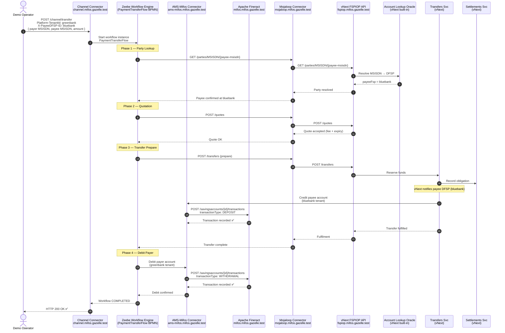
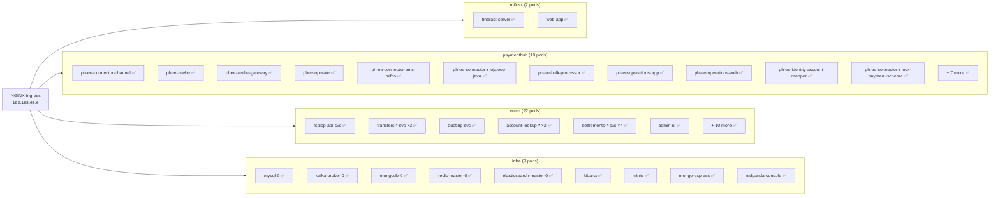
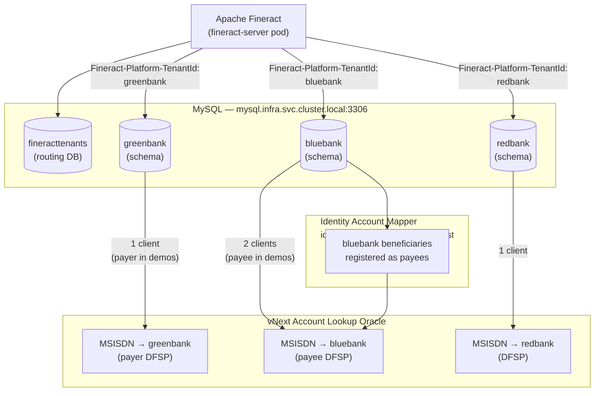
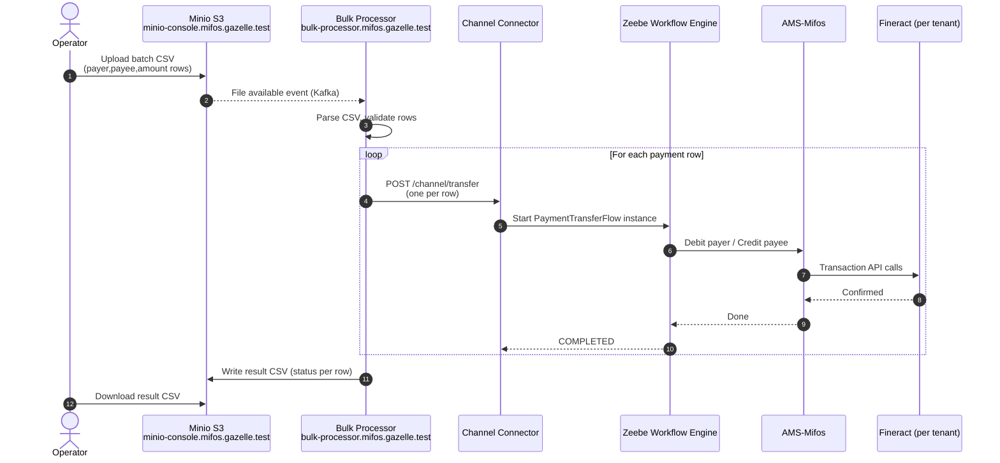
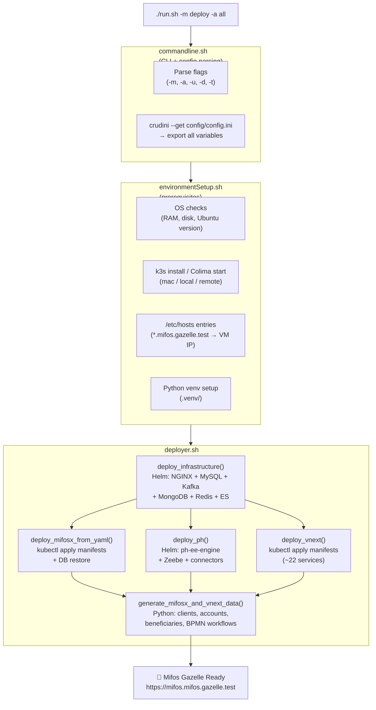

# Mifos Gazelle — Mermaid Diagrams
> Domain: mifos.gazelle.test | Generated: 2026-05-10
> Components enabled: MifosX ✅ · Payment Hub EE ✅ · Mojaloop vNext ✅ · Mastercard ❌

---

## Diagram 1 — End-to-End Payment Flow (Sequence)

Single payment from a Greenbank customer to a Bluebank customer via the full stack.



---

## Diagram 2 — Infrastructure Data Flows (Flowchart)

Data stores and how each component depends on them.

```mermaid
flowchart TB
    subgraph infra["☁ Infrastructure Namespace (infra)"]
        direction TB
        MySQL[(MySQL 8\nPort 3306)]
        Kafka([Kafka + Zookeeper\nPort 9092])
        MongoDB[(MongoDB\nPort 27017)]
        Redis[(Redis\nPort 6379)]
        ES[(Elasticsearch\nPort 9200)]
        Minio2[(Minio S3\nPort 9000)]
    end

    subgraph mifosx["🏦 MifosX Namespace (mifosx)"]
        Fineract[Fineract Server\nCore Banking API]
        WebApp[Mifos Web App\nUI]
        Fineract --> WebApp
    end

    subgraph paymenthub["⚡ PaymentHub Namespace (paymenthub)"]
        direction LR
        Channel[Channel\nConnector]
        Zeebe[Zeebe Engine]
        ZeebeGW[Zeebe Gateway]
        ZeebeOps[Zeebe Ops]
        Operate[Zeebe Operate\nUI]
        AMS[AMS-Mifos\nConnector]
        MojaConn[Mojaloop\nConnector]
        BulkProc[Bulk\nProcessor]
        OpsApp[Operations\nApp]
        OpsWeb[Operations\nWeb UI]
        Notif[Notifications\nConnector]
        IAMapper[Identity Account\nMapper]
        Importer[RDBMS\nImporter]
        PHMinio[(Minio\nbatch files)]
        PHRedis[(Redis\ncache)]
        PHMySQL[(Operations\nMySQL)]
        PHKafka([Kafka\nbranch)]

        Channel --> Zeebe
        Zeebe --> AMS
        Zeebe --> MojaConn
        ZeebeGW --> Zeebe
        ZeebeOps --> Zeebe
        OpsApp --> Importer
        BulkProc --> PHMinio
        OpsWeb --> OpsApp
    end

    subgraph vnext["🔀 Mojaloop vNext Namespace (vnext)"]
        direction LR
        FSPIOP[FSPIOP API Svc]
        Transfers2[Transfers Svc]
        Quotes2[Quoting Svc]
        ALO2[Account Lookup\nOracle]
        Participants[Participants Svc]
        Sched[Scheduling Svc]
        Settlements2[Settlements Svc]
        Auditing[Auditing Svc]
        AdminUI2[Admin UI]
        Reporting[Reporting\nServices ×4]

        FSPIOP --> Transfers2
        FSPIOP --> Quotes2
        FSPIOP --> ALO2
        Transfers2 --> Settlements2
    end

    %% Infra → MifosX
    MySQL -- "greenbank / bluebank /\nredbank schemas" --> Fineract

    %% Infra → PaymentHub
    PHMySQL -- "operations DB" --> OpsApp
    PHMySQL --> Importer
    PHKafka -- "payment events" --> Zeebe
    PHKafka --> Notif
    PHRedis --> Channel
    ES -- "audit + logs" --> OpsApp

    %% Infra → vNext
    MongoDB -- "transfer state" --> Transfers2
    MongoDB -- "settlements" --> Settlements2
    MongoDB -- "participants" --> Participants
    Kafka -- "domain events" --> FSPIOP
    Kafka --> Auditing

    %% Cross-namespace
    AMS -- "Fineract REST API" --> Fineract
    MojaConn -- "FSPIOP/1.1" --> FSPIOP
    IAMapper -- "beneficiary lookup" --> ALO2
```

---

## Diagram 3 — Kubernetes Namespace Topology

Namespaces, pod counts, and ingress endpoints on `192.168.68.6`.



---

## Diagram 4 — Multi-Tenant Bank Model

How the three tenant banks are structured within a shared MifosX instance.



---

## Diagram 5 — Bulk Payment Flow

Batch payment path (CSV upload through Payment Hub EE).



---

## Diagram 6 — Deployment Lifecycle (`run.sh`)

How a single command deploys the full stack.


