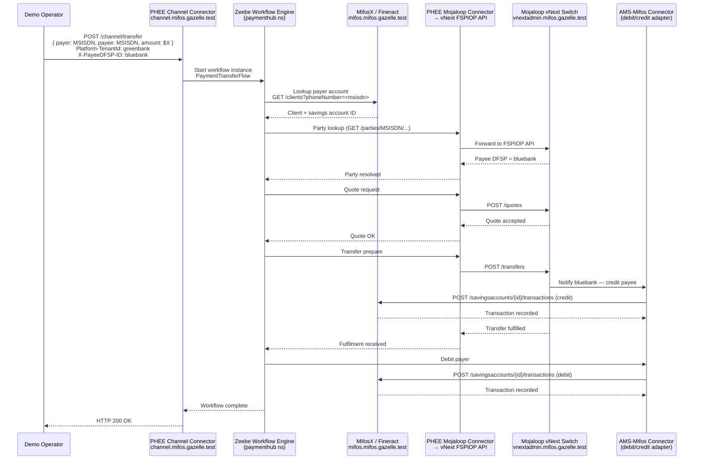
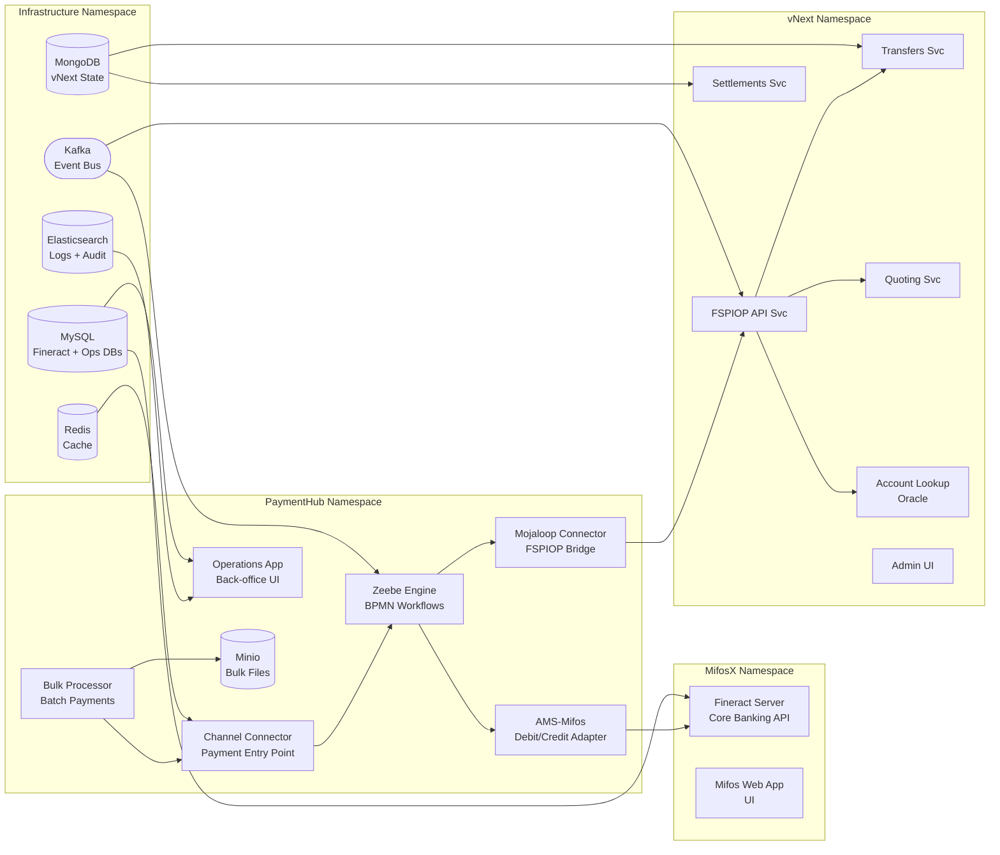

# Mifos Gazelle — Deployment Storyboard
> Generated: 2026-05-10 | Domain: mifos.gazelle.test | Mode: demo

---

## The Story in One Paragraph

Three financial institutions — Greenbank, Bluebank, and Redbank — each run their own core banking system and need to send money to each other's customers instantly and at low cost. Mifos Gazelle deploys, in a single command, a complete interoperable payment stack: **MifosX** manages each bank's accounts and transactions; **Payment Hub EE** orchestrates the payment workflow, handling routing, retries, and settlement logic; and **Mojaloop vNext** acts as the neutral payment switch that lets money move across bank boundaries without any bilateral integration. The result is a live, end-to-end demonstration of the Digital Public Goods stack that powers financial inclusion for the world's unbanked.

---

## Deployed Components

| Component | Status | Access URL | Purpose |
|-----------|--------|------------|---------|
| MifosX (Fineract) | ✅ Running | https://mifos.mifos.gazelle.test | Core banking — accounts, clients, transactions for 3 tenant banks |
| Payment Hub EE | ✅ Running | https://ops.mifos.gazelle.test | Payment orchestration — Zeebe workflows, channel, bulk processing |
| Mojaloop vNext | ✅ Running | http://vnextadmin.mifos.gazelle.test | Interoperable payment switch — FSPIOP API, settlements, account lookup |
| Zeebe Operate | ✅ Running | http://zeebe-operate.mifos.gazelle.test | BPMN workflow monitor — see live payment instances |
| Infra (MySQL, Kafka, MongoDB, Redis, ES) | ✅ Running | — | Shared data layer for all DPGs |
| Minio | ✅ Running | http://minio-console.mifos.gazelle.test | Bulk payment file storage |
| Kibana | ✅ Running | http://kibana.mifos.gazelle.test | Log analytics (Elasticsearch) |
| Redpanda Console | ✅ Running | http://redpanda-console.mifos.gazelle.test | Kafka topic browser |

---

## How the Systems Interact



---

## The Tenants

Three banks are pre-configured as Fineract tenants, each with their own isolated MySQL database schema on the shared MySQL instance at `mysql.infra.svc.cluster.local:3306`:

| Bank | Tenant ID | DB Schema | Timezone | Clients |
|------|-----------|-----------|----------|---------|
| Greenbank | `greenbank` | greenbank | Australia/Adelaide | 1 (payer in demos) |
| Bluebank | `bluebank` | bluebank | Australia/Adelaide | 2 (payee in demos) |
| Redbank | `redbank` | redbank | Australia/Adelaide | 1 |

Clients are generated deterministically by `generate-mifos-vnext-data.py` — the same client MSISDNs appear every run, so demo scripts work without looking up IDs first. Each client has a savings account with a starting balance. Bluebank clients are registered as payees with the **Identity Account Mapper** (`identity-mapper.mifos.gazelle.test`) so the vNext built-in oracle can resolve their MSISDN → DFSP.

---

## Data Flows



---

## Walking Through a Payment (Step by Step)

This uses `src/utils/make-payment.sh` with default settings: payer from **greenbank**, payee from **bluebank**.

**1. Operator runs the script**
```bash
src/utils/make-payment.sh -v
```
The script auto-queries Fineract's REST API to find the first client in `greenbank` (payer) and the first client in `bluebank` (payee). It displays names and prompts for an amount (0–500 USD).

**2. Transfer request sent to Channel Connector**

The script POSTs to `https://channel.mifos.gazelle.test/channel/transfer` with:
- `Platform-TenantId: greenbank` — identifies the sending bank
- `X-PayeeDFSP-ID: bluebank` — identifies the receiving bank
- `X-CorrelationID: <uuid>` — idempotency key
- Body: payer MSISDN, payee MSISDN, amount in USD

**3. Zeebe workflow instantiated**

Payment Hub EE starts a `PaymentTransferFlow` BPMN instance in Zeebe. The workflow is visible immediately in **Zeebe Operate** at `http://zeebe-operate.mifos.gazelle.test` — you can watch the token move through gates in real time.

**4. Party lookup via Mojaloop vNext**

Zeebe calls the Mojaloop Connector, which sends a `GET /parties/MSISDN/{payee-msisdn}` to vNext's FSPIOP API. vNext looks up the payee in its Account Lookup Oracle (populated by `register-beneficiaries.py`) and returns `bluebank` as the payee DFSP.

**5. Quote and transfer**

Zeebe drives a quote request (fee and FX calculation) then a transfer prepare through the FSPIOP API. vNext routes to the bluebank DFSP handler, which calls back to the AMS-Mifos connector to credit the payee's savings account in Fineract.

**6. Debit the payer**

On fulfilment, Zeebe instructs AMS-Mifos to debit the payer's savings account in the `greenbank` Fineract tenant.

**7. Verification (with `-v` flag)**

The script polls `GET /savingsaccounts/{id}?associations=transactions` on both the payer and payee accounts until the last transaction amount matches the transfer amount. Timeout: 2 minutes (6 retries × 20s). Displays final balance for both accounts.

**Expected output:**
```
✅ Transfer successful (HTTP 200)
   Current Balance: $490.00   ← payer (debited $10)
   Last Transaction: $10.00
   Current Balance: $1010.00  ← payee (credited $10)
   Last Transaction: $10.00
```

---

## Access the Deployment

| System | URL | Credentials |
|--------|-----|-------------|
| MifosX Web UI | https://mifos.mifos.gazelle.test | mifos / password |
| Payment Hub Ops | https://ops.mifos.gazelle.test | — |
| Zeebe Operate | http://zeebe-operate.mifos.gazelle.test | demo / demo |
| vNext Admin | http://vnextadmin.mifos.gazelle.test | — |
| Minio Console | http://minio-console.mifos.gazelle.test | — |
| Kibana | http://kibana.mifos.gazelle.test | — |
| Redpanda (Kafka) | http://redpanda-console.mifos.gazelle.test | — |
| MongoDB Express | http://mongoexpress.mifos.gazelle.test | — |

> **macOS note:** Firefox, Chrome, and Opera require Local Network permission to reach `192.168.68.6` (Colima VM). Visit `https://mifos.mifos.gazelle.test` first and accept the self-signed cert before navigating elsewhere.

---

## 3-Minute Demo Script

> Audience: financial inclusion decision-maker. Cluster is fully deployed and healthy. Have two browser tabs ready: MifosX and Zeebe Operate.

---

### 0:00–0:30 — Set the scene in MifosX

> *"Three banks are live on this system right now — Greenbank, Bluebank, and Redbank. Each one runs its own core banking system, powered by Apache Fineract, the same engine used by hundreds of microfinance institutions worldwide."*

- Open **https://mifos.mifos.gazelle.test**, log in as `mifos / password`
- Click **Clients** → show 1–2 client profiles with savings account balances
- Switch tenant (top-right dropdown) to **bluebank** → show a client there too

> *"These banks have no direct connection to each other. But watch what happens when a Greenbank customer needs to send money to someone at Bluebank."*

---

### 0:30–1:30 — Run the payment

- Switch to terminal, run:
```bash
src/utils/make-payment.sh -v
```
- When prompted for amount, enter **50**

> *"The payment goes through the Channel Connector into Payment Hub EE — that's the orchestration layer. It's about to drive a Mojaloop transfer across the switch."*

- While the script runs, narrate what's printing:
  - Auto-detected payer (Greenbank client name + MSISDN)
  - Auto-detected payee (Bluebank client name + MSISDN)
  - "Sending transfer request…"

> *"Payment Hub EE has just started a BPMN workflow — let's watch it live."*

---

### 1:30–2:30 — Show the workflow in Zeebe Operate

- Switch to browser tab: **http://zeebe-operate.mifos.gazelle.test**
- Navigate to **Process Instances** → find the running `PaymentTransferFlow` instance

> *"This is the payment journey — each box is a step in the workflow. You can see it doing party lookup, getting a quote from Mojaloop, and now preparing the transfer. Mojaloop vNext is the neutral switch in the middle — neither bank needs to know how the other one works."*

- Watch the token move to **Completed** (or if already complete, click the most recent instance)

> *"The workflow completed. Mojaloop confirmed the transfer, and Payment Hub has already told both banks to update their books."*

---

### 2:30–3:00 — Confirm settlement in MifosX

- Switch back to MifosX tab, navigate to the payer's savings account

> *"Greenbank's customer has been debited \$50. If we switch to Bluebank..."*

- Switch tenant to **bluebank**, open the payee's savings account → show the \$50 credit

> *"Bluebank's customer has the money. Two banks, one neutral switch, no bilateral integration — that's the power of Digital Public Goods built on open standards."*

---

*Storyboard generated from live cluster state. All 60+ pods Running as of 2026-05-10.*
